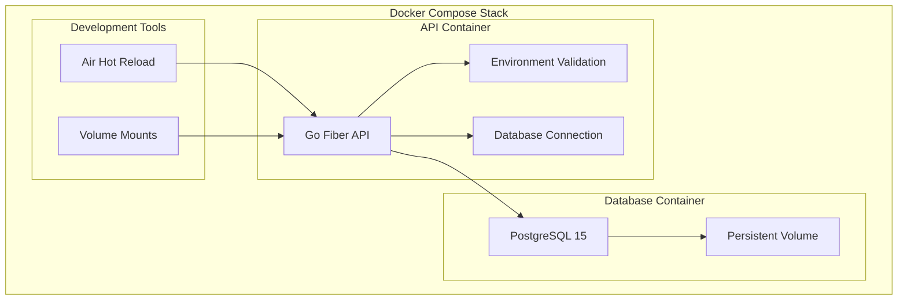

# Design Document

## Overview

This design outlines the containerization strategy for the tt-stock-api Go application using Docker and Docker Compose. The solution provides a complete development environment with PostgreSQL database, supports both development and production builds, and enforces explicit environment configuration for security.

## Architecture

### Container Architecture



### Multi-Stage Docker Build

The Dockerfile will use a multi-stage build approach:

1. **Builder Stage**: Compile the Go application with all dependencies
2. **Development Stage**: Include development tools (Air for hot reload)
3. **Production Stage**: Minimal runtime image with compiled binary

### Network Architecture

- **Internal Network**: Docker Compose creates an isolated network for API-Database communication
- **External Access**: API exposed on configurable port (default: 8080)
- **Database Access**: PostgreSQL accessible internally only, with optional external port for development

## Components and Interfaces

### Docker Compose Services

#### API Service (`tt-stock-api`)
- **Base Image**: `golang:1.21-alpine` (builder), `alpine:latest` (production)
- **Build Context**: Root directory with multi-stage Dockerfile
- **Environment**: Loaded from `.env` file with validation
- **Volumes**: Source code mount for development hot reload
- **Health Check**: HTTP endpoint check on `/health`
- **Restart Policy**: `unless-stopped`

#### Database Service (`postgres`)
- **Base Image**: `postgres:15-alpine`
- **Environment**: Database credentials and configuration
- **Volumes**: Persistent data storage in named volume
- **Health Check**: PostgreSQL connection check
- **Initialization**: Custom init scripts for database setup

#### Development Service (`api-dev`)
- **Extends**: API service with development overrides
- **Hot Reload**: Air tool for automatic restart on code changes
- **Debug Support**: Delve debugger port exposure
- **Volume Mounts**: Live source code mounting

### Environment Configuration

#### Required Environment Variables
```bash
# Security - No defaults, must be provided
JWT_SECRET=<required-no-default>
DB_PASSWORD=<required-no-default>

# Database Configuration  
DB_HOST=postgres
DB_PORT=5432
DB_NAME=tt_stock_db
DB_USER=tt_stock_user

# Application Configuration
PORT=8080
ENV=development
```

#### Environment Validation
The application will validate all required environment variables at startup:
- Check for presence of JWT_SECRET and DB_PASSWORD (no defaults allowed)
- Validate JWT_SECRET minimum length (32 characters minimum)
- Validate DB_PASSWORD strength requirements
- Exit with clear error messages if any required variables are missing or invalid

### File Structure
```
├── Dockerfile                 # Multi-stage build definition
├── docker-compose.yml         # Production/base compose file
├── docker-compose.dev.yml     # Development overrides
├── docker-compose.override.yml # Local development defaults
├── .env.example              # Environment template
├── .dockerignore             # Docker build exclusions
├── scripts/
│   ├── wait-for-postgres.sh  # Database readiness check
│   └── docker-entrypoint.sh  # Container startup script
└── docker/
    ├── postgres/
    │   └── init.sql          # Database initialization
    └── api/
        └── .air.toml         # Hot reload configuration
```

## Data Models

### Docker Volumes

#### Database Volume (`postgres_data`)
- **Type**: Named volume
- **Purpose**: Persistent PostgreSQL data storage
- **Backup Strategy**: Volume backup commands in Makefile
- **Cleanup**: Explicit volume removal commands

#### Development Volume (`go_modules`)
- **Type**: Named volume  
- **Purpose**: Go modules cache for faster builds
- **Scope**: Development environment only

### Environment Files

#### `.env` (Required for startup)
```bash
JWT_SECRET=your-production-jwt-secret-here
DB_PASSWORD=secure-database-password
DB_NAME=tt_stock_db
DB_USER=tt_stock_user
PORT=8080
ENV=production
```

#### `.env.dev` (Development overrides)
```bash
ENV=development
LOG_LEVEL=debug
HOT_RELOAD=true
```

## Error Handling

### Startup Validation
1. **Environment Check**: Validate all required environment variables
2. **Database Connection**: Retry logic with exponential backoff
3. **Health Checks**: Container health monitoring
4. **Graceful Shutdown**: Signal handling for clean container stops

### Error Scenarios

#### Missing Environment Variables
```bash
Error: Required environment variable JWT_SECRET is not set (no default provided for security)
Error: Required environment variable DB_PASSWORD is not set (no default provided for security)
Error: JWT_SECRET must be at least 32 characters long
Please check your .env file and ensure all required security variables are configured.
Application will not start without explicit security configuration.
```

#### Database Connection Failures
- Retry connection with exponential backoff (1s, 2s, 4s, 8s, 16s)
- Log connection attempts for debugging
- Exit after maximum retry attempts with clear error message

#### Container Health Checks
- API health endpoint: `GET /health`
- Database health: PostgreSQL connection check
- Automatic container restart on health check failures

## Testing Strategy

### Development Testing
- **Unit Tests**: Run inside development container with mounted source
- **Integration Tests**: Full stack testing with test database
- **Hot Reload Testing**: Automatic test execution on code changes

### Container Testing
- **Build Testing**: Verify multi-stage builds complete successfully
- **Environment Testing**: Validate environment variable handling
- **Network Testing**: Verify service-to-service communication
- **Volume Testing**: Confirm data persistence across restarts

### Production Testing
- **Image Security**: Scan production images for vulnerabilities
- **Performance Testing**: Container resource usage monitoring
- **Deployment Testing**: Verify production deployment scenarios

## Security Considerations

### Image Security
- **Non-root User**: Production containers run as non-root user
- **Minimal Base**: Alpine Linux for smaller attack surface
- **No Secrets in Images**: All secrets via environment variables
- **Multi-stage Builds**: Remove build tools from production images

### Network Security
- **Internal Network**: Database not exposed externally by default
- **Port Binding**: Only necessary ports exposed
- **Environment Isolation**: Separate networks for different environments

### Data Security
- **Volume Permissions**: Proper file system permissions
- **Secret Management**: Environment variables for sensitive data
- **Database Security**: Strong passwords required, no defaults

## Development Workflow Integration

### Makefile Integration
New Docker-related commands will be added to the existing Makefile:

```makefile
# Docker commands
docker-build:          # Build Docker images
docker-up:             # Start all services
docker-down:           # Stop all services
docker-dev:            # Start development environment
docker-test:           # Run tests in containers
docker-logs:           # View container logs
docker-clean:          # Clean up containers and volumes
```

### Hot Reload Development
- Air tool for automatic Go application restart
- Source code volume mounting for live updates
- Automatic dependency installation on go.mod changes
- Debug port exposure for IDE integration

### Database Management
- Automatic database initialization on first startup
- Volume-based data persistence
- Easy database reset and cleanup commands
- Direct database access for development debugging