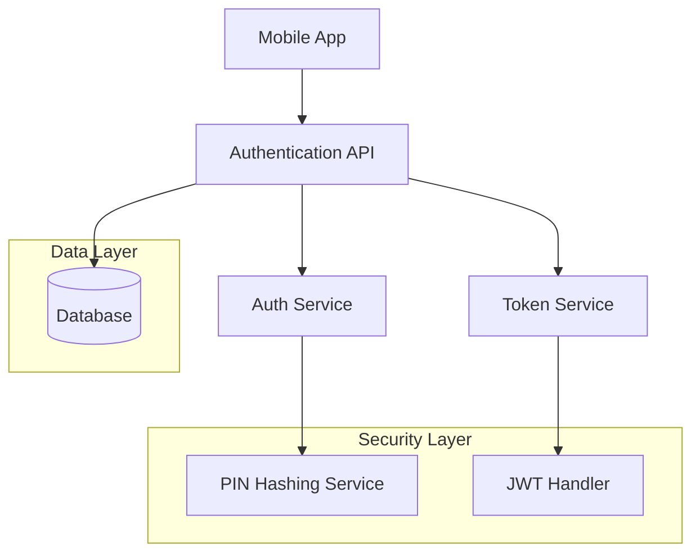

# Mobile Authentication API Design Document

## Overview

The Mobile Authentication API is a RESTful service designed to provide secure authentication and session management for mobile applications. The system uses Thai phone numbers as unique user identifiers and 6-digit PINs for authentication, implementing JWT-based token authentication with refresh token capabilities.

### Key Design Principles
- Security-first approach with proper PIN hashing and token management
- Mobile-optimized with lightweight responses and efficient token handling
- Stateless authentication using JWT tokens
- Simple and intuitive API design for mobile app integration

## Architecture

### High-Level Architecture



### Technology Stack
- **Language**: Go (Golang)
- **Web Framework**: Fiber
- **Database**: PostgreSQL for user data and token blacklist
- **Authentication**: JWT (JSON Web Tokens) for access and refresh tokens
- **Security**: bcrypt for PIN hashing
- **Architecture**: Clean Architecture + SOLID principles

## Components and Interfaces

### Project Structure
```
myapp/
├── cmd/
│   └── api/
│       └── main.go                 # Entry point
├── internal/
│   ├── app/
│   │   ├── routes/
│   │   │   └── routes.go           # Register routes & middlewares
│   │   └── server.go               # Create and configure Fiber app
│   ├── auth/
│   │   ├── handler.go              # HTTP handlers (login, logout, refresh)
│   │   ├── service.go              # Auth business logic (JWT, bcrypt)
│   │   └── middleware.go           # JWT validation middleware
│   ├── user/
│   │   ├── model.go                # User struct + JSON tags
│   │   ├── repository.go           # DB queries (find user)
│   │   └── service.go              # User-related logic
│   ├── db/
│   │   └── db.go                   # Database connection
│   └── config/
│       └── config.go               # Load env vars, JWT secret, DB path
├── pkg/
│   ├── utils/
│   │   └── password.go             # Helper (hash/check PIN)
│   └── response/
│       └── response.go             # Consistent API response format
├── .env
├── go.mod
├── go.sum
├── Makefile
└── README.md
```

### 1. Authentication Handler (`internal/auth/handler.go`)
Handles HTTP requests for authentication endpoints.

**Endpoints:**
- `POST /auth/login` - User authentication
- `POST /auth/refresh` - Token refresh
- `POST /auth/logout` - User logout

### 2. Authentication Service (`internal/auth/service.go`)
Core business logic for user authentication and validation.

**Key Methods:**
- `AuthenticateUser(phoneNumber, pin string) (*User, error)` - Validates credentials
- `GenerateTokens(userID uuid.UUID) (string, string, error)` - Creates access and refresh tokens
- `ValidatePhoneNumber(phoneNumber string) error` - Thai phone number format validation
- `ValidatePin(pin string) error` - 6-digit PIN format validation

### 3. User Repository (`internal/user/repository.go`)
Data access layer for user operations.

**Key Methods:**
- `FindByPhoneNumber(phoneNumber string) (*User, error)` - Retrieves user by phone number
- `VerifyPin(user *User, pin string) error` - Compares hashed PINs

### 4. JWT Middleware (`internal/auth/middleware.go`)
Protects routes and validates tokens.

**Key Methods:**
- `JWTProtected() fiber.Handler` - Middleware for protected routes
- `ExtractUserFromToken(c *fiber.Ctx) (*User, error)` - Extracts user info from valid token

## Data Models

### User Model (`internal/user/model.go`)
```go
type User struct {
    ID          string    `json:"id" db:"id"`
    PhoneNumber string    `json:"phone_number" db:"phone_number"`
    PinHash     string    `json:"-" db:"pin_hash"`           // Hidden from JSON
    CreatedAt   time.Time `json:"created_at" db:"created_at"`
    UpdatedAt   time.Time `json:"updated_at" db:"updated_at"`
    LastLoginAt *time.Time `json:"last_login_at,omitempty" db:"last_login_at"`
}
```

### Token Blacklist Model
```go
type TokenBlacklist struct {
    ID            uuid.UUID `json:"id" db:"id"`
    Token         string    `json:"token" db:"token"`
    UserID        uuid.UUID `json:"user_id" db:"user_id"`
    TokenType     string    `json:"token_type" db:"token_type"` // "access" or "refresh"
    ExpiresAt     time.Time `json:"expires_at" db:"expires_at"`
    BlacklistedAt time.Time `json:"blacklisted_at" db:"blacklisted_at"`
}
```

### API Response Models (`pkg/response/response.go`)
```go
type LoginResponse struct {
    Success bool `json:"success"`
    Data    struct {
        AccessToken  string `json:"access_token"`
        RefreshToken string `json:"refresh_token"`
        ExpiresIn    int64  `json:"expires_in"` // Access token expiration in seconds
        User         struct {
            ID          string `json:"id"`
            PhoneNumber string `json:"phone_number"`
        } `json:"user"`
    } `json:"data"`
}

type ErrorResponse struct {
    Success bool `json:"success"`
    Error   struct {
        Code    string `json:"code"`
        Message string `json:"message"`
    } `json:"error"`
}

type SuccessResponse struct {
    Success bool        `json:"success"`
    Data    interface{} `json:"data,omitempty"`
    Message string      `json:"message,omitempty"`
}
```

## Error Handling

### Error Categories
1. **Validation Errors** (400)
   - Invalid phone number format
   - Invalid PIN format
   - Missing required fields

2. **Authentication Errors** (401)
   - Invalid credentials
   - Expired tokens
   - Blacklisted tokens

3. **Authorization Errors** (403)
   - Insufficient permissions

4. **Not Found Errors** (404)
   - User not found

5. **Server Errors** (500)
   - Database connection issues
   - Token generation failures

### Error Response Format
```json
{
  "success": false,
  "error": {
    "code": "INVALID_CREDENTIALS",
    "message": "Invalid phone number or PIN"
  }
}
```

## Security Considerations

### PIN Security
- PINs are hashed using bcrypt with individual salts
- Minimum work factor of 12 for bcrypt
- PINs are never stored or logged in plain text

### Token Security
- Access tokens expire in 15 minutes
- Refresh tokens expire in 1 day
- Tokens are blacklisted on logout
- JWT secrets are stored securely in environment variables

### Input Validation
- Thai phone number format: `^0[0-9]{9}$`
- PIN format: `^[0-9]{6}$`
- All inputs are sanitized and validated

### Rate Limiting
- Login attempts limited to 5 per minute per phone number
- Token refresh limited to 10 per minute per user

## Testing Strategy

### Unit Tests
- Table-driven tests for authentication service logic
- Token generation and validation functions
- PIN hashing and verification utilities
- Input validation functions
- Repository layer with mocked database

### Integration Tests
- API endpoint functionality with test database
- Database operations and migrations
- Token lifecycle management
- Error handling scenarios

### Security Tests
- PIN hashing verification with bcrypt
- Token expiration and signature validation
- Blacklist functionality
- Input validation edge cases

### Testing Tools
- Go's built-in `testing` package
- Testify for assertions and mocks
- Test database setup and teardown
- HTTP testing with Fiber's test utilities

### Code Quality
- `go fmt` for formatting
- `go vet` for static analysis
- `golangci-lint` for comprehensive linting
- Test coverage reporting